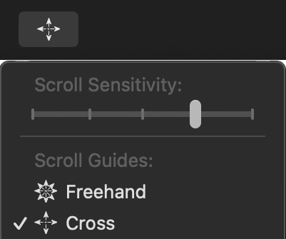
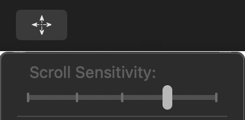
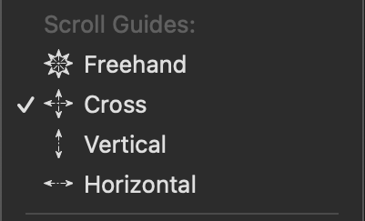
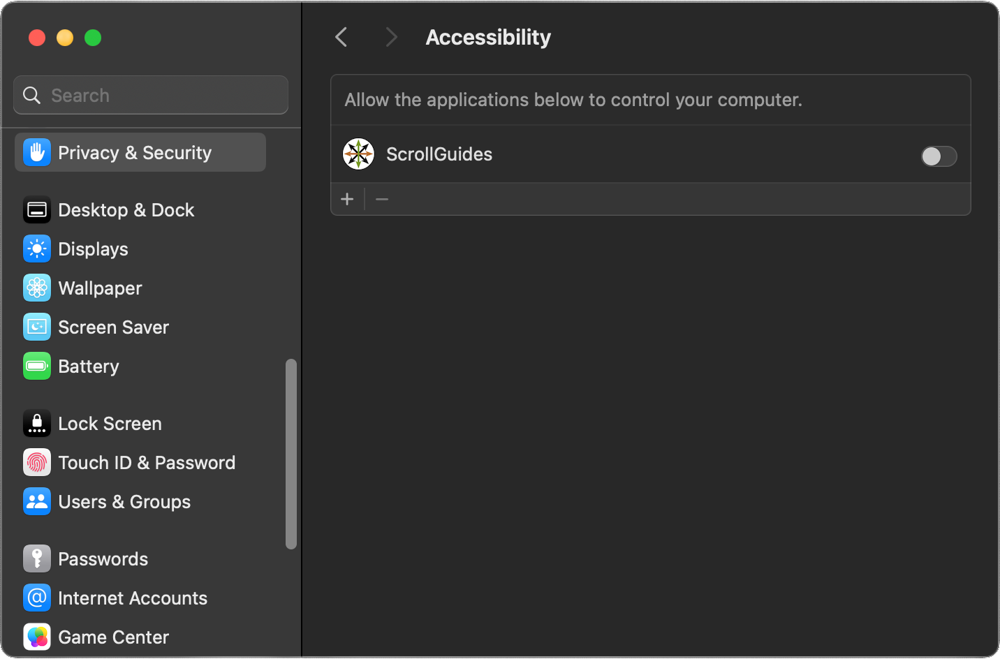
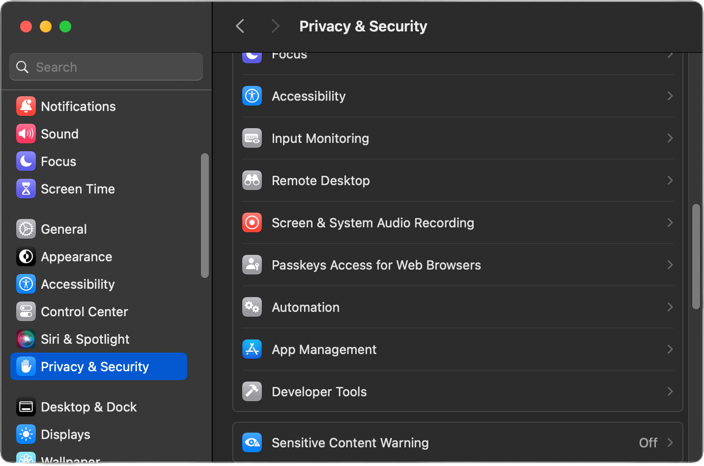

#  ScrollGuides

Scrolling: Powerfully Enhanced, Simply Adjustable

Exclusively for: macOS

## What does it do?

ScrollGuides seeks to take the amazing promise of 360 degree scrolling  and help the user better convey their intentions through presetting the  scrolling outcomes they desire.  Tested on various pointer input  devices, ScrollGuides delivers a highly compatible experience with  greater control.  
Regardless if you want to filter out small  scroll movements or guide your scrolling in a perfectly straight  horizontal or vertical direction, ScrollGuides delivers a more  intentional and linear experience.  Simple manual adjustments allow for  different behavior based on the user’s current needs.  
<a href="../../releases">Download It</a>

## 123 Scroll

### Install it.

ScrollGuides is distributed as a self contained macOS Application.  Simply ensure it winds up in your Applications folder and you are ready to launch it.

### Launch it.

Click on the ScrollGuides icon for the first time and you’ll discover that it requires additional access to macOS in order to function.  Follow the steps indicated, then launch ScrollGuides again.  Note:  ScrollGuides only keeps it own settings and runs in a sandbox to prevent it from accessing any of your data without your explicit permission.

### Tweak it.

Make adjustments quickly and intuitively through ScrollGuides’ menu bar icon.  Scroll in the window you are currently using and cycle back to the menu to further refine your selections at will.

## Two Options, Many Possibilities

### Filter It.

ScrollGuides gives you the ability to control the sensitivity of scrolling by filtering out small, likely inadvertent, movements without losing inertia.  Quickly adjust from maximum, unmodified, sensitivity all the way down to filtering out all scrolling, temporarily, with carefully curated levels in-between.  From overly sensitive applications to ergonomic issues, this option has a surprising ability to reduce frustrations.

### Guide it.

360 degree freehand scrolling can be a wonderful navigation tool.  However, it often has unintended consequences.  From slowly drifting off course in a spreadsheet to apps that activate functionality by swiping left or right, having some guides available can greatly increase productivity.  In practice these two sets of options compliment each-other very well to nearly eliminate unexpected and unintended scrolling behavior.

<a href="../../releases">Download It</a>

## Launch ScrollGuides for the First Time

### Launch it.

Click on the ScrollGuides icon in your Applications folder.  Note:  ScrollGuides only keeps its own settings and it runs in a sandbox to prevent it from accessing any of your data without your explicit permission.

### Configure it.

You’ll discover that ScrollGuides requires additional access to macOS in order to function.  Click on the “Open System Settings” button to be automatically taken to the proper place to enable ScrollGuides.

### Empower it.

Click to enable ScrollGuides, then use your credential to compleate the operation.

### Run it.

Click on the ScrollGuides icon in your Applications folder again and ScrollGuides will launch.

### Tweak it.

Make adjustments quickly and intuitively through ScrollGuides’ menu bar icon.  Scroll in the window you are currently using and cycle back to the menu to further refine your selections at will.

## Failed to load ScrollGuides

### Launch failed!

It happened, you tried to load ScrollGuides and you got the message pictured instead.  No problem!  Simply follow the steps in this section and you should be up and running shortly.

### Open System Settings.

It happened, you tried to load ScrollGuides and you got the message pictured instead.  No problem!  Simply follow the steps in this section and you should be up and running shortly.

### Select Privacy &amp; Security then Accessibility.

Careful!  You may think you want Accessibility on the left hand side, you do not.  What you are changing is a Privacy setting, so we need to select Privacy &amp; Security then select Accessibility in the main pane on the right.

### Empower it.

Click to enable ScrollGuides, then use your credential to complete the operation.

### Run it.

Click on the ScrollGuides icon in your Applications folder again and ScrollGuides will launch.

### Tweak it.

Make adjustments quickly and intuitively through ScrollGuides’ menu bar icon.  Scroll in the window you are currently using and cycle back to the menu to further refine your selections at will.

## Launch ScrollGuides Automatically

### Open System Settings.

If you find ScrollGuides helpful, you will probably want it to launch at login.  To set this up, the first thing you will need to do is open System Settings from the Applications folder.

### Add to Login Items

Find and select Login Items on the left hand side.  Add ScrollGuides to the list of apps under &quot;Open at Login&quot; on the right hand side by pressing the plus sign (+) at the bottom and selecting ScrollGuides from the Applications folder.

